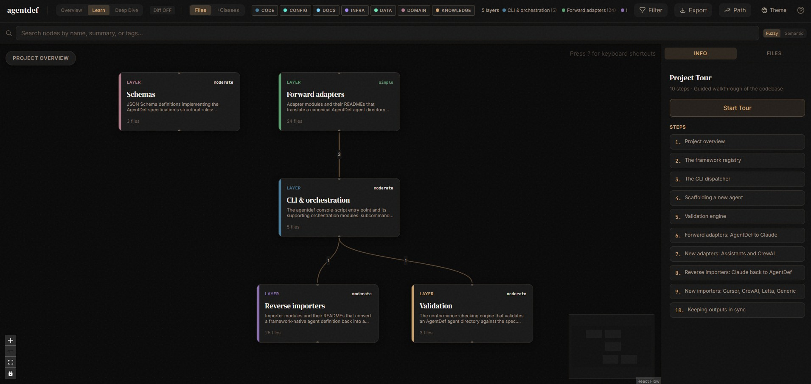

# AgentDef — Portable AI Agent Definitions

> Define your agent once. Run it on any framework.

Every AI platform invents its own way to define agents — `CLAUDE.md`,
`AGENTS.md`, `cursor-rules.md`, `copilot-instructions.md`, declarative
manifests... The concepts are always the same; only the files differ.
AgentDef is an open specification that captures what an agent IS —
identity, instructions, skills, workflows, tools — in one canonical,
human-readable directory. **Adapters** generate the file each platform
wants; **importers** convert your existing files back into the canonical
form ([505 real community agents imported with zero failures](https://agentdef.github.io/agentdef/scorecard/)).

## Quick Start

An AgentDef agent is just a directory. The spec defines canonical
components — `agent.md` (identity), `manifest.yaml` (composition),
`instructions/`, and optionally `skills/`, `workflows/`, `tools/`,
`knowledge/`, `memory/`, `runtime/`, `evals/` — everything is plain
markdown and YAML, made to live in git.

The smallest valid agent:

```
my-agent/
├── agent.md          # Who is this agent?
├── manifest.yaml     # What does it use?
└── instructions/
    └── core.md       # How does it behave?
```

Copy the [starter template](templates/starter) and fill in your content —
or let `agentdef init` do it for you:

## CLI

```bash
pip install agentdef
```

```bash
agentdef init my-agent --yes                 # scaffold a valid agent
agentdef validate ./my-agent/
agentdef adapt claude ./my-agent/ --output CLAUDE.md
agentdef import copilotstudio agent-doc.md --output ./my-agent/
agentdef sync ./my-agent/                    # regenerate all configured framework files
agentdef list                                # every adapter/importer framework
```

8 adapters (Claude, OpenAI AGENTS.md, Cursor, GitHub Copilot, LangGraph,
M365 Copilot, OpenAI Assistants, CrewAI) · 9 importers (those plus Copilot
Studio, Letta `.af`, and any markdown prompt file). Every import writes an
`IMPORT_REPORT.md`: what mapped, what was inferred, what was dropped —
nothing is dropped silently.

## Take the tour

Explore this repo's own architecture as an interactive knowledge graph,
with a guided 10-step walkthrough of the codebase:

[](https://agentdef.github.io/agentdef/dashboard/)

**[▶ Open the live dashboard](https://agentdef.github.io/agentdef/dashboard/)** —
generated from the code itself with the **understand-anything** plugin, so
it can't silently go stale.

## Documentation

Full docs: **https://agentdef.github.io/agentdef/**

- [Getting started](https://agentdef.github.io/agentdef/getting-started/) — first agent, validate, adapt, sync
- [Migrate in 5 minutes](https://agentdef.github.io/agentdef/migrations/claude/) — from CLAUDE.md, Copilot, Cursor, AGENTS.md, or any prompt file
- [Examples](examples/) — including a [real end-to-end demo](examples/claude-to-copilot-demo/) (Claude subagent → AgentDef → Copilot)
- [Importer scorecard](https://agentdef.github.io/agentdef/scorecard/) · [Comparisons](https://agentdef.github.io/agentdef/comparisons/) · [FAQ](https://agentdef.github.io/agentdef/faq/)
- [Specification](spec/SPEC.md) — spec 0.5, with a public [conformance corpus](conformance/)

## Status

**Spec 0.5.0 · tooling 0.2.0** — see [STATUS](docs/STATUS.md) and the
[ROADMAP](ROADMAP.md). The format is stable enough for experimentation and
feedback; breaking changes are possible before 1.0.

## Contributing

See [CONTRIBUTING.md](CONTRIBUTING.md). Want a framework we don't cover?
[Open a framework request](https://github.com/agentdef/agentdef/issues/new?template=framework_request.md).

## License

Apache 2.0 — see [LICENSE](LICENSE).
