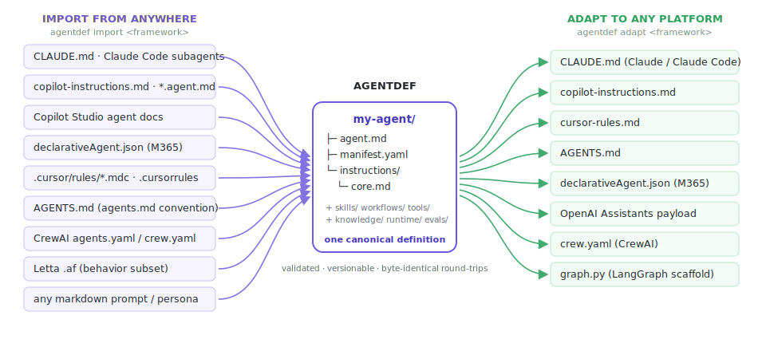

# AgentDef

> Define your agent once. Run it on any framework.

AgentDef is an open specification + toolkit for defining AI agents in a
framework-independent, human-readable format: one canonical definition,
adapters out to 8 frameworks, importers in from 9 formats, deterministic
and validated against 500+ real community agents ([scorecard](scorecard.md)).

- **Start here:** [Getting started](getting-started.md)
- **Migrate in 5 minutes:** [CLAUDE.md](migrations/claude.md) · [Copilot](migrations/copilot.md) · [Cursor](migrations/cursor.md) · [AGENTS.md](migrations/openai.md) · [anything](migrations/generic.md)
- **Spec:** see `spec/SPEC.md` in the repository (v0.5, with conformance corpus)
