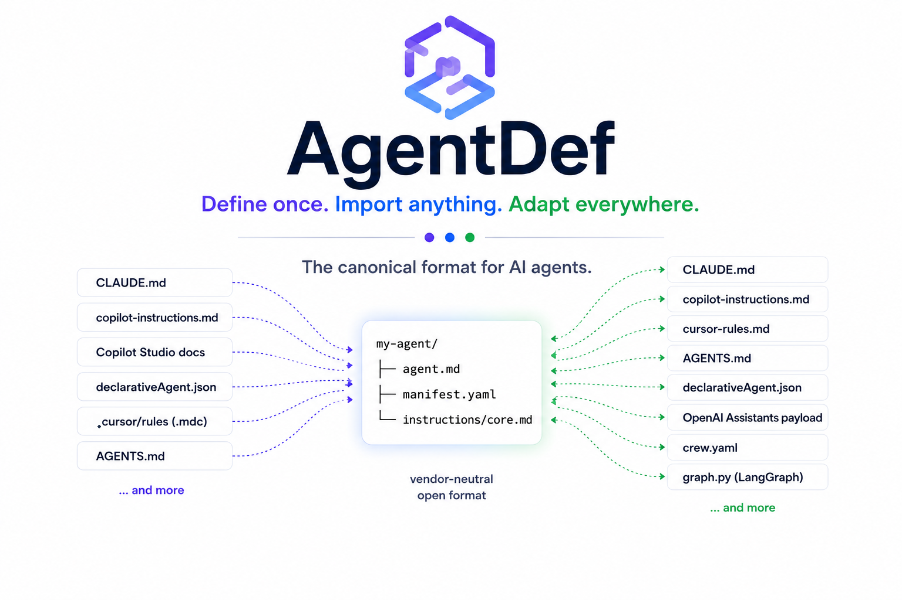

# AgentDef

<p align="center">
  
</p>

**AgentDef is an open specification for defining AI agents in a
framework-independent, human-readable format.** One canonical definition —
plain markdown and YAML, made to live in git — with importers in from 9
formats and adapters out to 8 platforms, deterministic and validated
against 500+ real community agents.

```bash
pip install agentdef
agentdef import claude CLAUDE.md --output ./my-agent   # bring an existing agent
agentdef validate ./my-agent                            # check conformance
agentdef adapt copilot ./my-agent                       # generate for another platform
```

## Why AgentDef

<div class="grid cards" markdown>

- :material-swap-horizontal: **Bidirectional**

    Most spec projects only go spec→runtime. AgentDef puts equal weight on
    **importers**: your existing `CLAUDE.md`, Copilot, Cursor, or CrewAI
    definitions convert automatically, with an item-by-item
    `IMPORT_REPORT.md` — nothing dropped silently.

- :material-check-decagram: **Verified, not vibes**

    [505 real community agents imported with zero failures](scorecard.md).
    Round-trips reach a byte-identical fixed point, tested in CI. A public
    [conformance corpus](https://github.com/agentdef/agentdef/tree/main/conformance)
    lets third parties check any validator.

- :material-file-tree: **Human-readable**

    An agent is a directory: `agent.md` (identity), `manifest.yaml`
    (composition), `instructions/` (behavior). Product managers can read
    and edit it; git can diff it.

- :material-sync: **One source of truth**

    Declare targets in a `sync:` block and `agentdef sync` regenerates
    every framework file; `--check` fails CI when they drift.

</div>

## Explore

<div class="grid cards" markdown>

- **[Get started](getting-started.md)** — first agent, validate, adapt, sync
- **[Migrate in 5 minutes](migrations/claude.md)** — from CLAUDE.md, Copilot, Cursor, AGENTS.md, or any prompt file
- **[CLI & frameworks reference](cli.md)** — every command, adapter, importer, and error code
- **[Take the architecture tour](dashboard-tour.md)** — interactive knowledge graph of this repo
- **[Spec 0.5](https://github.com/agentdef/agentdef/blob/main/spec/SPEC.md)** — conformance rules, schemas, round-trip guarantees
- **[How it compares](comparisons.md)** — Letta, AgentSchema, the other AgentSpecs, and friends

</div>
